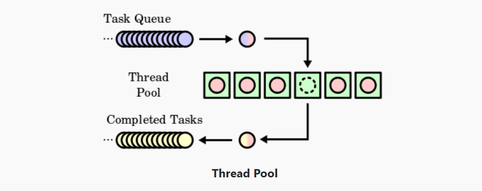

# thread pool

## thread pool

- `newSingleThreadExecutor`: only one worker in thread pool
- `newFixedThreadPool`: fixed number of workers in thread pool
- `newCachedThreadPool`: no number limit of workers in thread pool

### source code

- [Main1](./src/main/java/gxg/Main1.java)
- [Main2](./src/main/java/gxg/Main2.java)

## scheduled thread pool

- `newSingleThreadScheduledExecutor`: only one worker in thread pool
- `newScheduledThreadPool`: fixed number of workers in thread pool

### api

- `<V> ScheduledFuture<V> schedule(Callable<V> callable, long delay, TimeUnit unit)`: Creates and executes a ScheduledFuture that becomes enabled after the given delay.
- `ScheduledFuture<?> schedule(Runnable command, long delay, TimeUnit unit)`: Creates and executes a one-shot action that becomes enabled after the given delay.
- `ScheduledFuture<?> scheduleAtFixedRate(Runnable command, long initialDelay, long period, TimeUnit unit)`: Creates and executes a periodic action that becomes enabled first after the given initial delay, and subsequently with the given period; that is executions will commence after initialDelay then initialDelay+period, then initialDelay + 2 * period, and so on.
- `ScheduledFuture<?> scheduleWithFixedDelay(Runnable command, long initialDelay, long delay, TimeUnit unit)`: Creates and executes a periodic action that becomes enabled first after the given initial delay, and subsequently with the given delay between the termination of one execution and the commencement of the next.

### source code

- [Main3](./src/main/java/gxg/Main3.java)
- [Main4](./src/main/java/gxg/Main4.java)
- [Main5](./src/main/java/gxg/Main5.java)

## reference

- [Java 8 Concurrency Tutorial: Threads and Executors](https://winterbe.com/posts/2015/04/07/java8-concurrency-tutorial-thread-executor-examples/)
- [Executor Interfaces](https://docs.oracle.com/javase/tutorial/essential/concurrency/exinter.html)
- [Thread Pools](https://docs.oracle.com/javase/tutorial/essential/concurrency/pools.html)