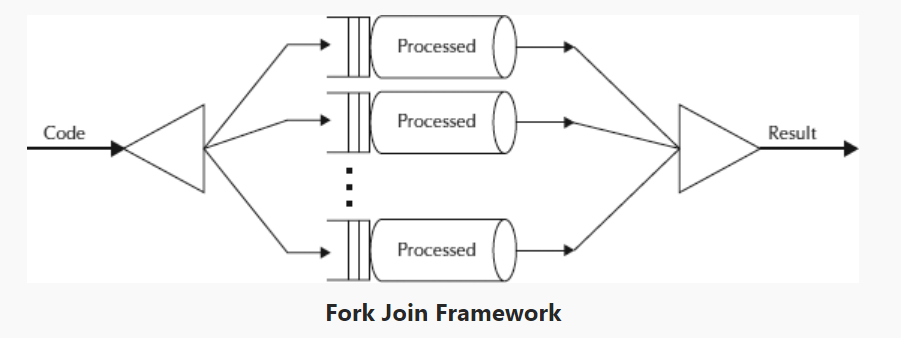

# introduction

## task parallel

Tasks can be decomposited into subtasks, and subtasks are connected with dependency. So subtasks can be described by a directed acyclic graph, such as 

## time complexity

Assume that

- subtasks can be executed in  time in sequential situation
- subtasks can be executed in  time when there are infinite processes
-  is the actual number of processes

[Blumofe and Leiserson](http://supertech.csail.mit.edu/papers/steal.pdf) proves that the optimal time complexity is .

### simple proof

Assume that every subtask one unit time, then the optimal time complexity is  with

-  is the number of tasks
-  is the depth of directed acyclic graph

We assume that  are the number of tasks in each step of depth. So we have 

## work stealing

[Blumofe and Leiserson](http://supertech.csail.mit.edu/papers/steal.pdf) proves that work stealing can achieve the optimal time complexity.

## reference

- [Work stealing](https://en.wikipedia.org/wiki/Work_stealing)
- [Scheduling Multithreaded Computations by Work Stealing](http://supertech.csail.mit.edu/papers/steal.pdf)
- [Chapter 10 Work-Stealing](http://www.cs.tau.ac.il/~shanir/multiprocessor-synch-2003/steal/notes/steal.pdf)
- [并行算法科普向 系列之一：计算模型，调度器，和其它](https://zhuanlan.zhihu.com/p/90172780)