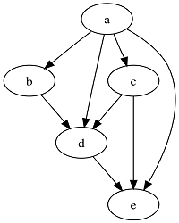

# introduction

## task parallel

Tasks can be decomposited into subtasks, and subtasks are connected with dependency. So subtasks can be described by a directed acyclic graph, such as 

## time complexity

Assume that

- subtasks can be executed in  time in sequential situation
- subtasks can be executed in  time when there are infinite processes
-  is the actual number of processes

[Blumofe and Leiserson](http://supertech.csail.mit.edu/papers/steal.pdf) proves that the optimal time complexity is .

### simple proof

Assume that every subtask one unit time, then the optimal time complexity is  with

-  is the number of tasks
-  is the depth of directed acyclic graph

## work stealing