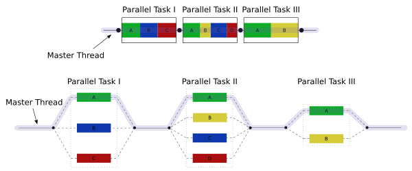

# fork-join

<div align=center></div>

## feature

### 1

- binary forking (work stealing)
  - child stealing
  - continuation stealing
- n-ary forking (no working stealing)

### 2

- iterative
- recursive

## pattern

```
solve(problem):
    if problem is small enough:
        solve problem directly (sequential algorithm)
    else:
        for part in subdivide(problem)
            fork subtask to solve(part)
        join all subtasks spawned in previous loop
        return combined results
```

## reference

- [Fork–join model](https://en.wikipedia.org/wiki/Fork%E2%80%93join_model)
- [并行算法科普向 系列之二：前缀和，fork-join 和矩阵乘法](https://zhuanlan.zhihu.com/p/91089093)